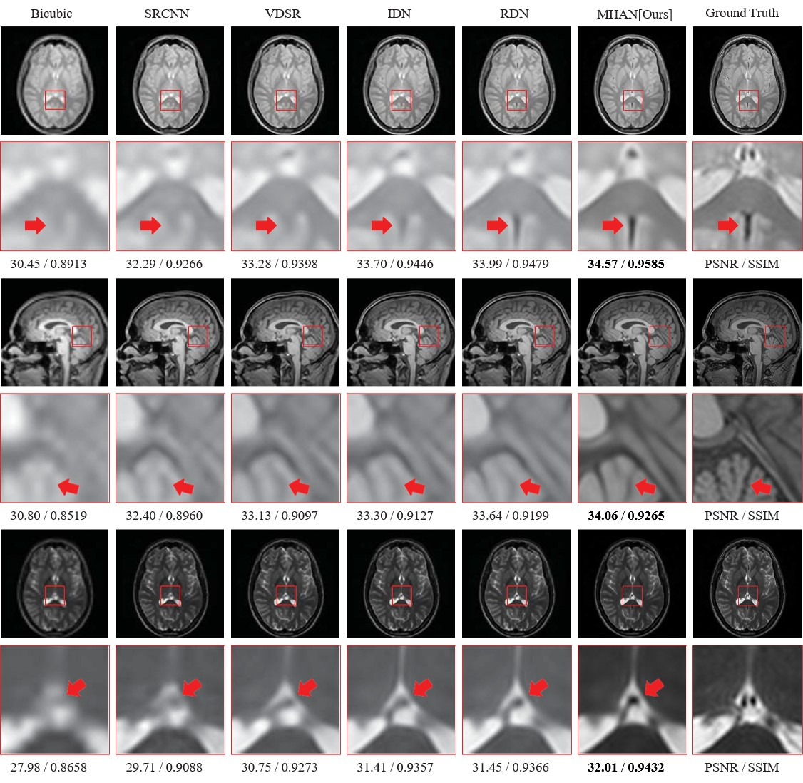

## Enhancing MR Image Super-Resolution with a Multi-Head Attention Network: Capturing High-Dimensional Medical Features

Repository for the paper Enhancing MR Image Super-Resolution with a Multi-Head Attention Network: Capturing High-Dimensional Medical Features.

### Abstract
Magnetic Resonance (MR) imaging is essential for clinical diagnostics, supporting etiological analysis, treatment planning, and disease evaluation. However, MR image quality can be compromised due to factors such as equipment variability, dosage limitations, and patient diversity, resulting in reduced resolution and impaired lesion identification. This study proposes a novel Multi-Head Attention Network (MHAN) to enhance MR image super-resolution. MHAN employs a 3D Multi-Head Attention Mechanism Module (3D-MHead) and a Depth-Width Feature Fusion Module (DW-FFM). The 3D-MHead module adapts attention weights across MR image dimensions to improve feature differentiation, while the DW-FFM combines shallow and deep features for coherent, high-resolution reconstructions. Experiments on various MR imaging datasets demonstrate that MHAN achieves superior performance over existing models, improving quantitative metrics, visual quality, and lesion detectability. Moreover, MHAN exhibits high generalizability, as evidenced by consistent improvements in natural image reconstructions. This study contributes an effective approach for enhancing MR image quality, with implications for advancing diagnostic precision and treatment planning in medical imaging.


### Experimental Platform and Environment

- **Hardware**: NVIDIA GeForce RTX 3090 GPU
- **CUDA Version**: 11.7
- **Python Version**: 3.9
- **PyTorch Version**: 1.12

To set up the environment, please install the required packages using `requirements.txt`:

```bash
pip install -r requirements.txt
```


### Data Preparation

The data used in this study includes the DIV2K, Set5, Set14, BSD100, Urban100, Manga109 and IXI dataset. You can download the datasets and place them in the `data` directory. The data directory.

- DIV2K dataset - [link](https://data.vision.ee.ethz.ch/cvl/DIV2K/)
- Set 5 dataset - [link](https://uofi.box.com/shared/static/kfahv87nfe8ax910l85dksyl2q212voc.zip)
- Set 14 dataset - [link](https://uofi.box.com/shared/static/igsnfieh4lz68l926l8xbklwsnnk8we9.zip)
- BSD 100 dataset - [link](https://uofi.box.com/shared/static/qgctsplb8txrksm9to9x01zfa4m61ngq.zip)
- Urban 100 dataset - [link](https://uofi.box.com/shared/static/65upg43jjd0a4cwsiqgl6o6ixube6klm.zip)
- Manga 109 dataset - [link](http://www.manga109.org/en/)
- IXI dataset - [link](https://brain-development.org/ixi-dataset/)


### Training

To train the model, use the following command:

```bash
# example for training the model with scale factor 4
python main.py --model mhan \
               --scale 4 \
               --dir_data your_dataset_dir \
               --data_train dataset_name \ 
               --n_resgroups 10 \
               --n_resblocks 20 \
               --n_feats 64 \
               --n_colors 3 \
               --rgb_range 255 \
               --epochs 400 \
               --batch_size 16 \
               --decay 50-100-200-300 \
               --ext img \
               --save my_train \
               --save_results
```

### Testing

To test the model, use the following command:

```bash
# example for testing the model with scale factor 4
python main.py --model mhan \
               --scale 4 \
               --pre_train your_pretrained_model_path \
               --dir_data your_dataset_dir \
               --data_test Set5+Set14+B100+Urban100+Manga109 \
               --n_resgroups 10 \
               --n_resblocks 20 \
               --n_feats 64 \
               --n_colors 3 \
               --rgb_range 255 \
               --ext img \
               --save my_test \
               --save_results \
               --test_only
```
You can change the upscaling factor using the `--scale` parameter. Available options are 2, 3, and 4.

### Results

Qualitative comparison results of different SR methods on MR images. Visual comparisons with our model using state-of-the-art methods at a scale factor of ×4. The key contrast parts in the red rectangle are shown enlarged below.
